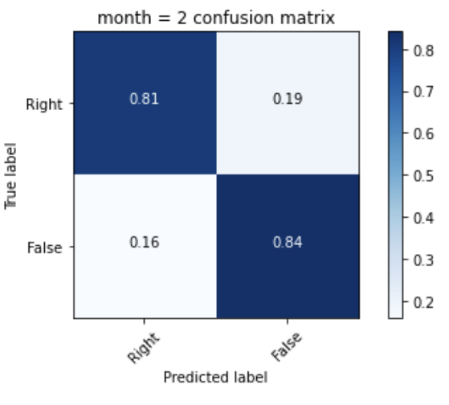

# ARC-AI-Phoniatrics
Articulation disorder is a common language problem in children, resulting in incorrect bite and unclear sentences. At present, there is no unified definition of the types of dysarthria in the medical profession in Taiwan. speech therapist must be provided in hospital treatment. After a series of pronunciation of the words, the therapist will make judgments based on the child’s pronunciation, and will continue to visit for several months to improve the pronunciation problems. This will cause the patient’s treatment cycle to be lengthened and the patient can only be treated in the hospital. We hope to automate the treatment process, use the phonetic character cards used in major hospitals as the basis for judgment, and combine the convolutional neural network in machine learning to classify several types of phonological errors and correct categories.

**Enviroment: Python 3.8
Demo on Himax WE-I Plus EVB Endpoint AI Development Board**

We collocate 15 types of Articulation disorder and non-Articulation disorder voice for this classifaction.
On the original Trainning have a great performance, but we wish it can run on the embedded-system use TFLite Model.

The original model is used to support doctor to check the pantient's pronunciation is true or not
And this project is for the familly to check the baby wheather have Articulation disorder or not ,so we want it run on the embedded-system.

Because we need to run on the embedded-system, we need to shrink the original model and function, and we purpose send the raw file to the model to predict.
In the test, we need to sort the result for the two type ("True", "False") for the smaller size for the embedded-system.


Code Explain:
  
  Trainning Dataset prepare:
  
  We total have 18871 audio files for this program, and we use augmentation method to expand to **27631 files**.
  We use the librosa to read and resize the smaple rate and label it.
```python
def read_audio_from_filename(filename, target_sr, ori_sr):
    audio, _ = librosa.load(filename, sr=ori_sr, mono=True)
    audio_target_sr = librosa.resample(y=audio, orig_sr=_, target_sr=target_sr) # ori_sr to target_sr
    audio_target_sr = audio_target_sr.reshape(-1, 1)
    #print(audio.shape)
    #print(audio_target_sr.shape)
    return audio_target_sr
```

  Model design:
  
  ```python
def m5(num_classes=5):
    print('Using Model M5')
    m = Sequential()
    m.add(Conv2D(64,
                 input_shape=(AUDIO_LENGTH, 1, 1),
                 kernel_size=(80,1),
                 strides=(4,1),
                 padding='same',
                 kernel_initializer='glorot_uniform',
                 kernel_regularizer=regularizers.l2(l=0.0001)))

    m.add(BatchNormalization())
    m.add(Activation('relu'))
    m.add(MaxPooling2D(pool_size=(4,1), strides=None))
    m.add(Conv2D(256,
                 kernel_size=(3,1),
                 strides=(1,1),
                 padding='same',
                 kernel_initializer='glorot_uniform',
                 kernel_regularizer=regularizers.l2(l=0.0001)))

    m.add(BatchNormalization())
    m.add(Activation('relu'))
    m.add(MaxPooling2D(pool_size=(4,1), strides=None))
    # m.add(Lambda(lambda x: K.mean(x, axis=1)))
    m.add(Flatten())
    m.add(Dense(num_classes, activation='softmax'))
    return m
```

  Confusion Matrix:
  
<p>
  
</p>


  Convert to TFLite Model:
  
  Because of the Development Board's microphone device was use int16 dtype, we want to change our input type to int16 to save normalization Time, and reduce operation stress.
  
  ```python
def representative_data_gen():
  for input_value in tf.data.Dataset.from_tensor_slices(X_train).batch(1).take(100):
    # Model has only one input so each data point has one element.
    yield [input_value]

converter = tf.lite.TFLiteConverter.from_keras_model(model)
converter.optimizations = [tf.lite.Optimize.DEFAULT]
converter.representative_dataset = representative_data_gen

# Ensure that if any ops can't be quantized, the converter throws an error
converter.target_spec.supported_ops = [tf.lite.OpsSet.EXPERIMENTAL_TFLITE_BUILTINS_ACTIVATIONS_INT16_WEIGHTS_INT8]

# Set the input and output tensors to INT16 (APIs added in r2.3)
converter.inference_input_type = tf.int16
converter.inference_output_type = tf.int16
tflite_model_quant = converter.convert()
  ```
